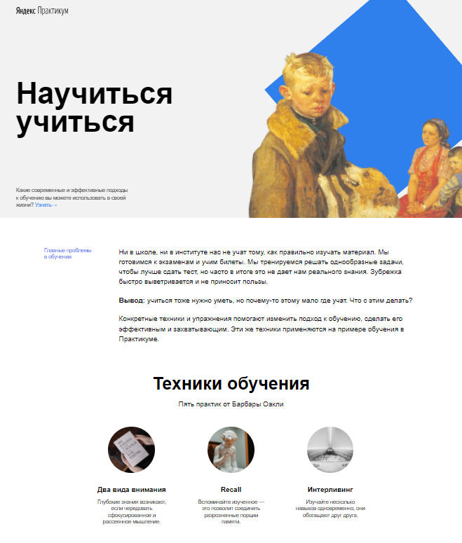

# HOW TO LEARN

#### *это проект, указывающий на важность правильного подхода к обучению.*
https://vgaidukov.github.io/how-to-learn/

Здесь вы найдете техники и упражнения, которые помогут сделать этот процесс эффективным и захватывающим.

## Содержание проекта:
 1. Главные проблемы в обучении
 2. Техники обучения
 3. Видео на TED
 4. История Барбары Оакли
 5. Метод Фейнмана
 6. Цифры и факты
 7. Рецензия на книгу C. Хана "Весь мир — школа"
 8. Принципы обучения от Д. Кауфмана
 9. Полезные ресурсы

 ## Автор проекта:

 #### Вадим Гайдуков
 Проект реализован с применением следующих технологий:
 - флексбокс-верстка
 - позиционирование
 - анимация
 - встраеваемый медиаконтент
 - структурирование проекта по правилам Nested БЭМ

 ## Preview :

 
